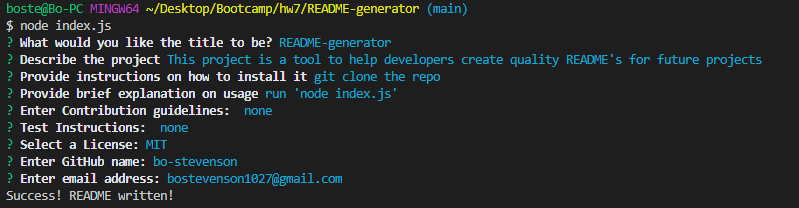

# README-generator

## Overview
This program uses node.js to generate a quality README file for future use on other projects.

## Table of Contents

1. [Installation](#installation)

2. [Usage](##usage)

3. [Contributions](#contribution)

4. [Test Instructions](#test-instructions)

5. [Screenshots](#screenshots)

6. [Licenses](#licenses)

7. [Questions](#questions)

## Installation

 Clone from the GitHub Repository.

## Usage

Answer the prompts and the program will automatically generate the README file for you.

## Contribution

none

## Test Instructions

undefined

## Screenshots

## License

    
## Questions? Contact Me!

My GitHub is [bo-stevenson](https://www.github.com/bo-stevenson).

My email is [bostevenson1027@gmail.com](mailto:bostevenson1027@gmail.com).
  

  